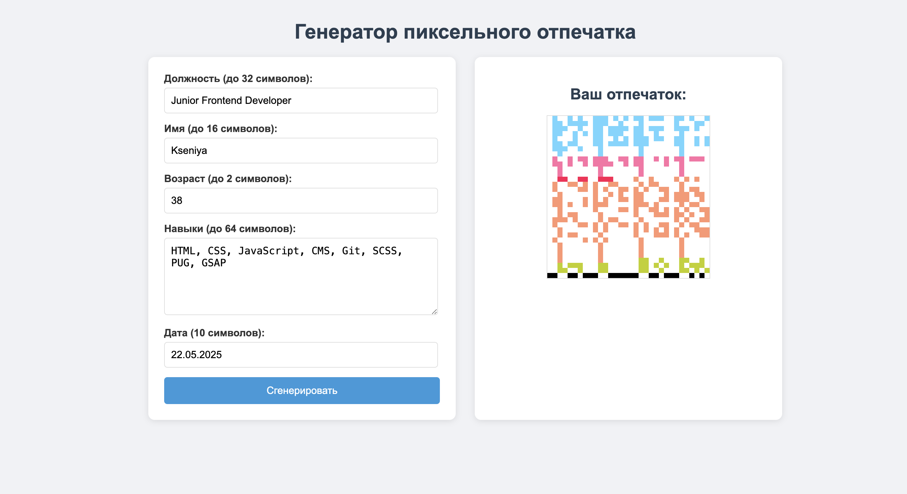

Инструмент для преобразования информации в уникальный графический "отпечаток" в виде пиксельного изображения с проверочной контрольной суммой.

## Основные возможности:

🎨 Визуализация данных: Преобразует текст в изображение 256×256 пикселей

🔢 Бинарное кодирование: Каждый символ конвертируется в 8-битную последовательность

🌈 Цветовая схема: Разные типы данных отображаются разными цветами

✔️ Контрольная сумма: Автоматическая проверка четности в последней строке

📱 Адаптивный дизайн: Работает на любых устройствах (чистый html/css/js)

## Как это работает:

Введите информацию:

Должность (32 символа)

Имя (16 символов)

Возраст (2 символа)

Навыки (64 символа)

Дата (10 символов)

Алгоритм:

Конвертирует каждый символ в ASCII-код

Преобразует код в 8-битную двоичную строку

Отображает каждый бит как блок 8×8 пикселей (1=цветной, 0=белый)

Вычисляет контрольные суммы для каждого столбца

Технические параметры:

Размер изображения: 256×256 пикселей

Размер блока: 8×8 пикселей на бит

Цвета:

Должность: #70d6ff (голубой)

Имя: #ff70a6 (розовый)

Возраст: #ff0a54 (красный)

Навыки: #ff9770 (оранжевый)

Дата: #bfd200 (зеленый)

Контрольная сумма: #000000 (черный)

Генерирует уникальный пиксельный узор с контрольной суммой в последней строке.

## Особенности реализации

Точное соответствие требованиям:

Размер изображения строго 256×256 пикселей

Каждый "пиксель" (логический блок) - 8×8 физических пикселей

Контрольная сумма только в последней строке

Удобный интерфейс:

Форма с валидацией длины вводимых данных

Автозаполнение текущей даты

Кнопка генерации отпечатка

Оптимизированный алгоритм:

Эффективное преобразование текста в бинарный вид

Быстрая отрисовка на Canvas

Корректный расчет контрольных сумм
